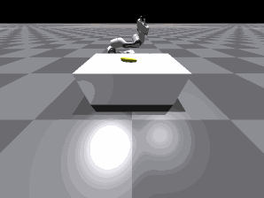
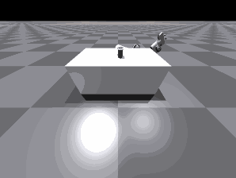
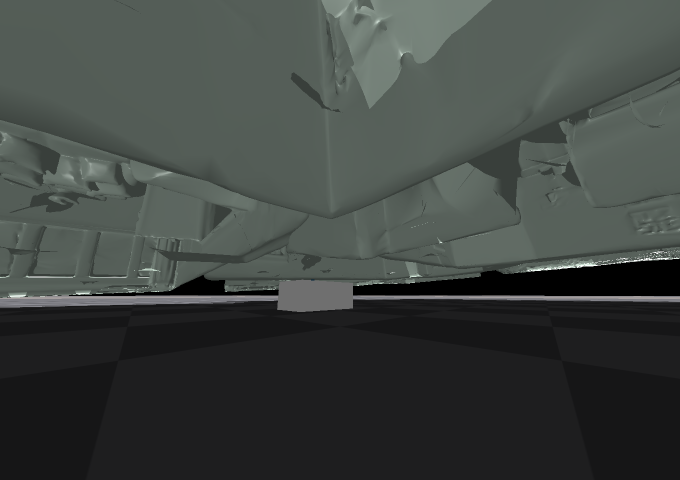

# Atomic Skills Library: Benchmarking Reinforcement Learning Algorithms in Robotics
By Charlie Cheng and Steed Amegbor

*this is our final project for the course [EECS C106B/206B: Robotic Manipulation and Interaction
](https://ucb-ee106.github.io/106b-sp23site/), taught by [Pro. Shankar  Sastry](https://people.eecs.berkeley.edu/~sastry/?_ga=2.87114842.392777382.1683554898-2671012.1678515581) at UC Berkeley.

Link to our report: [Atomic Skills Library: Benchmarking Reinforcement Learning Algorithms in Robotics](https://drive.google.com/file/d/1Dq8D8VffDMdmAhRGOBX_CUrkzwzN0Iy4/view?usp=sharing)

## Setup
The repository is built upon [MVP project](https://github.com/ir413/mvp). please refer to the setup instructions over there. We've removed asset folder from GitHub due to oversized file size. Please download the assets from [here](https://drive.google.com/file/d/1Dq8D8VffDMdmAhRGOBX_CUrkzwzN0Iy4/view?usp=sharing) and put it under `assets`.

## Running the code

run `python tools/train_ppo.py task=FrankaPickObjectPixels` to train the model with all caremas enabled and scenes imported.

## Some visualizations

